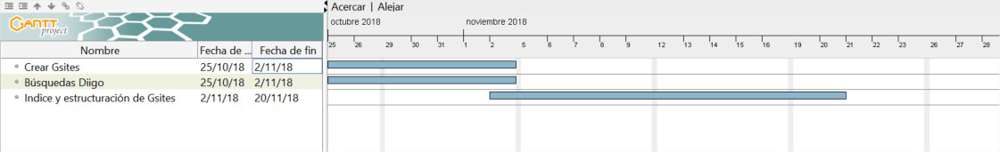

# Gsites

La creación del índice y estructura de la página en Google Sites, se basará en las búsquedas compartidas con el marcador social Diigo.

Con el podremos realizar búsquedas individuales para luego hacer un filtrado de los mejores enlaces que hayamos obtenido de manera personal.

El siguiente paso, después del filtrado, será compartirlo de manera grupal, incluyendo un pequeño resumen donde justifique su utilidad para el proyecto y una breve explicación de la estrategia empleada para su búsqueda.

*Nota: Debemos de usar recursos con licencias que no vulnere los derechos de autor*.

# Estructuración del proyecto aplicado a Gsites.

La primera parte de la estructura del proyecto tendrá que tener los tres apartados siguientes:
-	**Presentación:** Nombre del grupo, nombre de los componentes con vínculos a las páginas personales Gsites (Actividad individual del grupo), tema escogido, ubicación (universidad, estudios, asignatura, aula…etc) y una imagen ilustrativa del tema. 
-	**Índice del proyecto:** Se creará con el grupo una vez terminada la tarea de Diido, el índice vendrá acompañado de una justificación de cada apartado.
-	**Planificación:** Aquí el grupo tendrá que incorporar el backlog general del proyecto realizado en la Fase 1. Cada ciclo va a disponer de un apartado o página, con su formulario correspondiente y su backlog dónde especifique el seguimiento.

# Fechas. 
* **Creación del Gsites grupal** 25/10/18 – 02/11/18
* **Búsquedas Diigo** 25/10/18 – 02/11/18
* **Índice y estructuración de Gsites**	02/11/18 – 20/11/18

