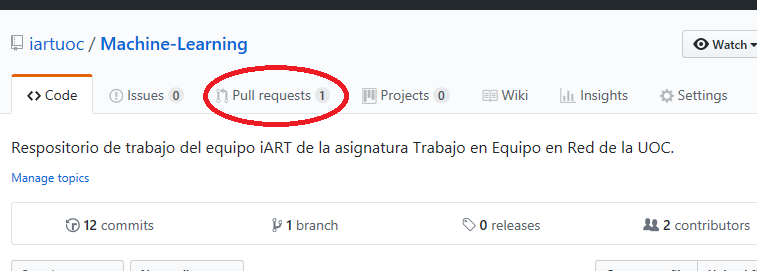
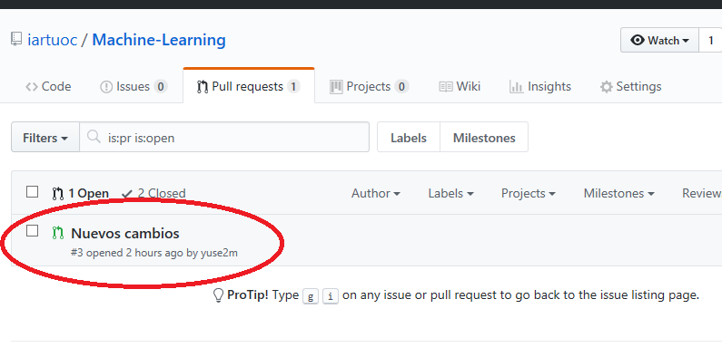
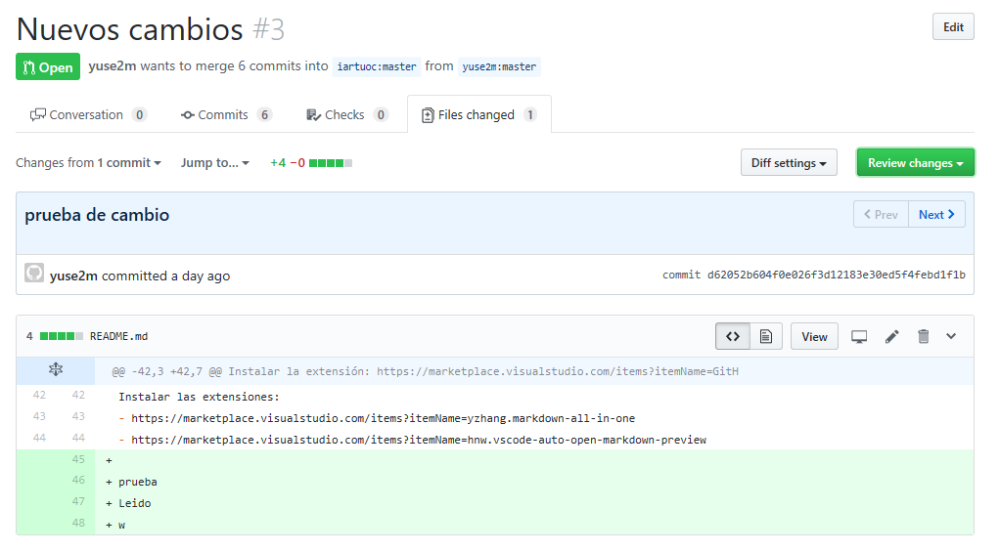
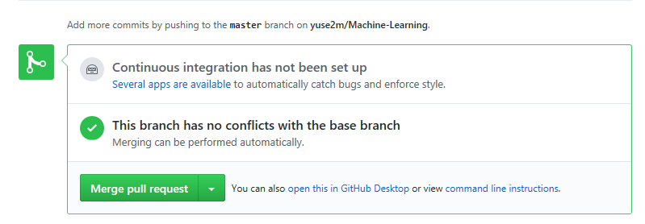
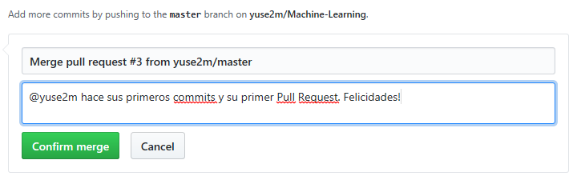

# Aceptar Pull Requests
El editor accede al repositorio oficial: https://github.com/iartuoc/Machine-Learning y observa que hay un nuevo Pull Request:

Se accede a la pestaña correspondiente y se examina el Pull Request:

Nos aparecerá el detalle del Pull Request y podremos ver los commits que se hicieron hasta llegar al Pull Request. Pulsando sobre un commit, podemos ver los detalles y los cambios:

Volvemos atrás, a la página principal del pull request y si todo va bien, veremos en la parte de abajo un aviso verde de que los cambios pueden ser implementados automáticamente y un botón verde:

Pulsamos el botón verde tal y como está (Merge Pull Request)

Nos aparecerán unos cuadros de texto con el título y el comentario por defecto. Es bueno acostumbrarse a poner comentario descriptivos:

Una vez puesto el comentario que queramos, le damos al botón verde: Confirm merge
