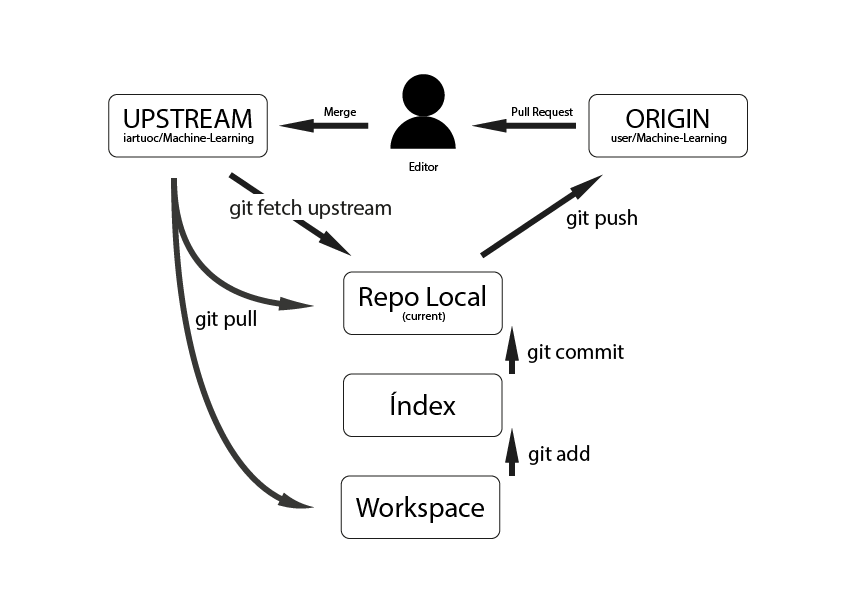

# Flujo de trabajo con git

Utilizaremos el modelo triangular de la siguiente ilustración:

Para ello tendremos que llevar a cabo una configuración previa.

## Configuración

Si hemos seguido los pasos descritos en el README.md, al escribir en Git Bash:

`git remote -v`

Veremos:

~~~~
origin          https://github.com/usuario/Machine-Learning.git (fetch)
origin          https://github.com/usuario/Machine-Learning.git (push)
upstream        https://github.com/iartuoc/Machine-Learning.git (fetch)
upstream        https://github.com/iartuoc/Machine-Learning.git (push)
~~~~

Eso quiere decir que tenemos bien configurado nuestros repositorios remotos: origin y upstream.

Si sólo nos salen las dos líneas de origin, escribiremos:

`git remote add upstream https://github.com/iartuoc/Machine-Learning.git`

### Ahorrando trabajo futuro

Para hacer más fáciles las cosas, vamos a configurar cómo queremos que trabaje por defecto el comando `git push`:

~~~~
git config remote.pushdefault origin
git config push.default current
~~~~

De esta forma, podremos escribir símplemente `git push` en lugar de: `git push origin tareaX.Y` (como veremos en la sección **Trabajar en la tarea**).

## Comenzar una nueva tarea

Usaremos una rama para cada tarea.

Lo primero que haremos será crear una nueva rama (branch) y decirle que queremos que reciba las actualizaciones de todo el equipo, es decir, que dependa directamente de upstream/master:

`git checkout -b tareaX.Y upstream/master`

Ese comando hace dos cosas al mismo tiempo. Primero crea la rama, tal y como haríamos con el comando:

`git branch tareaX.Y --track upstream/master`

y en segundo lugar, cambia la rama en la que estamos trabajando a la nueva tareaX.Y, tal y como haríamos con el comando:

`git checkout tareaX.Y`

## Trabajar en la tarea

Si actualmente no estamos trabajando en la rama de la tarea (estamos, por ejemplo, en master) lo primero que haremos será cambiar a la rama de la tarea como vimos en el apartado anterior:

`git checkout tareaX.Y`

A continuación, actualizamos nuestra rama y nuestros archivos, con la rama principal del equipo (upstream/master):

`git pull`

Si hemos creado archivos nuevos, los añadimos al índice con:

`git add .`

Cuando hayamos hecho cambios que queramos **confirmar**, hacemos commit:

`git commit -m "Descripción de los cambios hechos"`

Podemos ir confirmando diversos cambios y cuando queramos, actualizamos nuestro repositorio remoto:

`git push`

Como explicamos en la configuración inicial, con eso estamos sincronizando los cambios en nuestro repositorio remoto (origin) y en la misma rama en la que estábamos trabajando en local (tareaX.Y).

### Pull Request

En algún momento, querremos integrar los cambios que hemos hecho en el repositorio colectivo. Lo primero que haremos será preparar nuestro repositorio para que no haya conflictos:

**Actualizamos nuestra rama master:**
~~~~
git fetch upstream
git checkout master
git merge upstream/master
~~~~

**Repercutimos(rebase) los posibles cambios en la rama de nuestra tarea**
~~~~
git checkout tareaX.Y
git rebase master
~~~~

Para crear el pull request, accedemos a la web de Github y creamos el pull request fijándonos bien en seleccionar la rama de la tarea correctamente.
